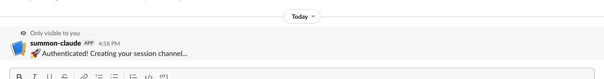
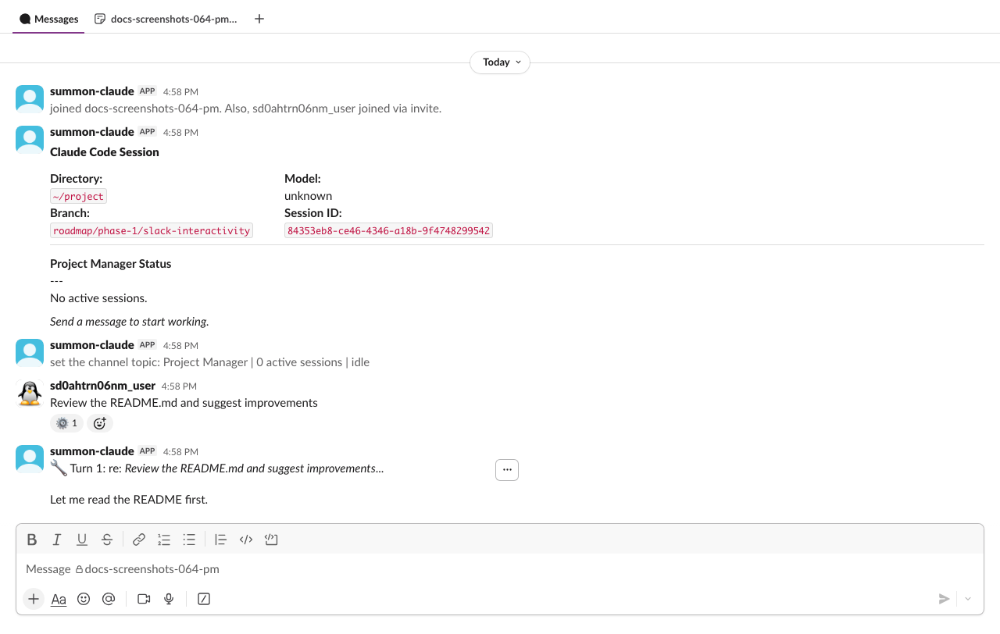
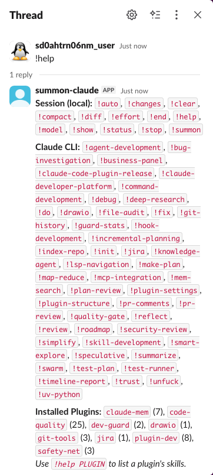

# Quick Start

This walkthrough sets up your first project with a PM agent. The PM spawns, directs, and monitors Claude sessions on your behalf — all through Slack.

## Prerequisites

- summon-claude [installed](installation.md)
- [Slack app configured](slack-setup.md) and [configuration verified](configuration.md) (`summon config check` passing)
- A project directory (any git repo works)

---

## Step 1: Register a project

Navigate to your project directory and register it:

```{ .bash .notest }
summon project add my-api ~/code/my-api
```

This creates a named project that summon-claude tracks. You can optionally set [workflow instructions](../guide/projects.md#managing-workflow-instructions) that guide every session:

```{ .bash .notest }
summon project workflow set my-api
```

---

## Step 2: Start your Project Manager agent

```{ .bash .notest }
summon project up
```

This starts PM agents for all registered projects. The PM prints an authentication code:

<!-- terminal:project-up -->
```
==================================================
  SUMMON CODE: a7f3b219
  Type in Slack: /summon a7f3b219
  Expires in 5 minutes
==================================================
```
<!-- /terminal:project-up -->

The code is single-use — type it exactly as shown in any Slack channel. Codes expire after 5 minutes; run `summon project up` again to get a new one.

!!! note "Background process"
    The session runs as a background daemon. You can close this terminal window after authenticating — Claude keeps running.

---

## Step 3: Authenticate in Slack

Open Slack, go to any channel where you want the PM to live, and type:

```
/summon ABC123
```

Use the exact code from your terminal. The PM agent binds to that channel.



!!! tip "Choose your channel"
    Each session gets its own dedicated channel. You can use an existing channel or create one specifically for this session. All of Claude's responses will appear there.

---

## Step 4: Give the PM its first task

Once authenticated, summon-claude posts a welcome message in the channel. Send the PM its first task directly in the channel:

```
Review the README and suggest improvements
```



???+ tip "Emoji lifecycle"
    summon-claude uses emoji reactions to show what Claude is doing:

    | Emoji | Meaning |
    |-------|---------|
    | :inbox_tray: | Message received, Claude is thinking |
    | :gear: | Claude is actively working (running tools) |
    | :white_check_mark: | Turn completed successfully |
    | :octagonal_sign: | Turn cancelled by `!stop` command |
    | :warning: | Turn ended with an error |

    For full details on emoji reactions and thread organization, see [Threading](../concepts/threading.md).

---

## Step 5: Review tool permissions

When Claude wants to use a tool (run a command, edit a file, etc.), summon-claude sends you an **ephemeral message** — visible only to you — with Approve/Deny buttons. A ping is also posted to the main channel so you get a notification.


Click **Approve** to let Claude proceed, or **Deny** to reject the action. Claude adapts its approach based on your decision. Read-only tools (file reads, searches, web fetches) are auto-approved without prompting — see [Permissions](../reference/permissions.md) for the full list.

Type `!help` in the Slack channel to see all available in-channel commands:

```
!help
```



Common commands:

| Command | Description |
|---------|-------------|
| `!help` | List all available commands |
| `!status` | Show session status and context usage |
| `!end` | End the session gracefully |
| `!stop` | Cancel the current Claude turn (session stays active) |

---

## Step 6: End the session

When you're done, stop all project sessions:

```{ .bash .notest }
summon project down
```

Or end just the PM session from Slack:

```
!end
```

Either method terminates the Claude session and posts a summary in the channel.

---

??? tip "Quick ad-hoc sessions (no project setup)"
    For one-off tasks that don't need a PM, use `summon start` directly:

    ```{ .bash .notest }
    summon start
    ```

    This creates a single session. Authenticate in Slack with `/summon CODE`, interact, and end with `!end` or `summon stop`.

    See [Sessions](../guide/sessions.md) for details.

---

## See also

- [Projects](../guide/projects.md) — multi-session project management with PM agents
- [Sessions](../guide/sessions.md) — session lifecycle, naming, and management
- [Commands](../reference/commands.md) — full command reference for in-channel interaction
- [Permissions](../reference/permissions.md) — how tool permission handling works
- [Configuration](../guide/configuration.md) — customize summon-claude behavior
