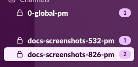

# Full Setup Walkthrough

??? info "Prerequisites"
    - summon-claude [installed](../getting-started/installation.md)
    - [Slack app configured](../getting-started/slack-setup.md)

This guide walks through configuring every feature of summon-claude end-to-end: initial configuration, GitHub and Google authentication, the scribe agent, project registration, and session management. Follow the sections in order for a complete setup, or jump to any section you need.

---

## Initial Configuration

Run the interactive setup wizard to create your initial configuration:

```bash
summon init
```

This walks you through setting your Slack bot token, signing secret, and workspace channel. The wizard validates Slack connectivity before saving, so a successful run means summon-claude is ready to go.

!!! tip "Re-run at any time"
    You can run `summon init` again to update any configuration value, or use `summon config set KEY VALUE` to change individual settings.

---

## GitHub Authentication

Authenticate with GitHub to give Claude access to GitHub tools in every session:

```bash
summon auth github login
```

This starts the GitHub device flow: your terminal displays a code and a URL. Open the URL in your browser, enter the code, and authorize the OAuth app. Once complete, the token is stored securely in summon's config directory.

The device flow looks like:

```
Visit: https://github.com/login/device
Enter code: ABCD-1234
Waiting for authorization...
Authenticated as: yourname
```

!!! note "No Copilot subscription required"
    The GitHub remote MCP server works with standard OAuth tokens. A GitHub Copilot subscription is not required.

Once authenticated, GitHub tools are wired into **all** sessions automatically — no per-session setup needed. See [GitHub Integration](github-integration.md) for details on available tools and permission handling.

---

## Google Workspace Authentication

Google authentication is optional and only needed if you plan to use the scribe's Google collector (Gmail, Calendar, Drive monitoring).

First, run the guided client secrets setup wizard:

```bash
summon auth google setup
```

This walks you through creating a Google Cloud project and OAuth client in your browser, then saves the client secrets file locally. You only need to do this once.

Next, complete the browser OAuth flow to grant access to your Google account:

```bash
summon auth google login
```

A browser window opens for Google consent. Grant access to the Google services you want the scribe to monitor. Credentials are stored in summon's config directory.

!!! note "Scope tiers"
    Google authentication uses standard OAuth scopes. The scribe requests only the scopes needed for the data sources you enable. See [Scribe Integrations](scribe-integrations.md) for the exact scopes used by each collector.

---

## External Slack Authentication (Scribe)

The scribe can monitor a Slack workspace *other than* the one summon uses for sessions. This is useful if your team communicates on a separate workspace and you want the scribe to surface important messages.

!!! note "Two separate workspaces"
    This section configures monitoring of an **external** Slack workspace. Your summon session workspace (configured in `summon init`) is separate and always connected.

Authenticate with an external Slack workspace using a profile name:

```bash
summon auth slack login acme.enterprise
```

The argument is the workspace name, enterprise domain, or full URL (e.g. `myteam`, `acme.enterprise`, or `https://myteam.slack.com`). This opens a browser for Slack OAuth consent on the external workspace. After authorizing, list the channels the authenticated user can see:

```bash
summon auth slack channels
```

For full browser monitoring setup instructions, including how to capture a persistent browser session, see [Scribe Integrations — Slack Browser Monitoring](scribe-integrations.md#slack-browser-monitoring).

After completing whichever auth providers you need, verify everything in one shot:

```bash
summon auth status
```

This shows the status of all configured providers — GitHub, Google, and external Slack.

---

## Scribe

The scribe is enabled by default. It auto-detects available collectors based on your authentication:

- **Google Workspace** — active when Google auth is configured (see above) and `workspace-mcp` is installed
- **External Slack** — active when Slack browser auth is configured (see above) and `playwright` is installed

No manual `config set` is needed. The scribe starts automatically with `summon project up` and posts to a dedicated `#0-summon-scribe` channel. Collectors whose dependencies or credentials are missing are silently skipped.

!!! tip "Disabling collectors"
    To explicitly disable a collector: `summon config set SUMMON_SCRIBE_GOOGLE_ENABLED false` or `summon config set SUMMON_SCRIBE_SLACK_ENABLED false`. To disable the scribe entirely: `summon config set SUMMON_SCRIBE_ENABLED false`.

For a full description of scribe behaviors, alert triage, quiet hours, and daily summaries, see the [Scribe Agent guide](scribe.md).

---

## Register Projects

Create demo project directories:

```bash
mkdir -p /tmp/summon-demo-api /tmp/summon-demo-frontend
```

Register each directory as a named project:

```bash
summon project add demo-api /tmp/summon-demo-api
```

```bash
summon project add demo-frontend /tmp/summon-demo-frontend
```

List registered projects to confirm:

```bash
summon project list
```

The table shows each project's name, directory, PM status, and channel prefix. For a newly registered project with no running sessions, the PM status shows as stopped.

??? info "Workflow instructions"
    After registering a project, you can set workflow instructions that are injected into the system prompt of every session in that project:

    ```bash
    summon project workflow set demo-api
    ```

    This opens your editor. Write any conventions, coding standards, or context you want Claude to always have. See [Projects — Managing workflow instructions](projects.md#managing-workflow-instructions) for details.

---

## Start Projects

Start PM agents for all registered projects:

```bash
summon project up
```

Each PM prints an authentication code:

```
==================================================
  SUMMON CODE: a7f3b219
  Type in Slack: /summon a7f3b219
  Expires in 5 minutes
==================================================
```

Open Slack, go to the channel where you want the PM to live, and type the `/summon CODE` command. Each PM binds to the channel where it's authenticated. Codes expire after 5 minutes — run `summon project up` again to generate new ones.

!!! note "Background daemon"
    Sessions run as a background daemon. You can close the terminal after authenticating — Claude keeps running. The scribe also starts automatically if enabled.

For step-by-step screenshots of the authentication flow, see [Quick Start — Step 2](../getting-started/quickstart.md#step-2-start-your-project-manager-agent).

---

## View Running Sessions

List all active sessions:

```bash
summon session list
```

Get the same output as JSON for scripting:

```bash
summon session list --output json
```

Check the database directly for stored session records and storage usage:

```bash
summon db status
```

`summon db status` reads SQLite directly and works even when the daemon is not running. It shows the number of sessions by status, total database size, and last modified time.

---

## Slack Channels View

After authenticating one or more projects, summon-claude creates dedicated Slack channels for each session:



Each PM session gets a channel named after the project (e.g. `#demo-api-pm`). Child sessions spawned by the PM get their own channels using the project's channel prefix. The scribe, if enabled, lives in `#0-summon-scribe`. All channels are created automatically — you don't need to create them in advance.

---

## Stop Projects

Stop all running project sessions:

```bash
summon project down
```

This gracefully shuts down all PM agents and their child sessions. Verify everything has stopped:

```bash
summon session list
```

To stop a single project without affecting others:

```bash
summon project down demo-api
```

!!! tip "Suspend vs stop"
    `summon project down` marks child sessions as `suspended` so they can be restarted cleanly with `summon project up`. This lets you stop and resume a project without losing PM context.

---

## See also

- [Quick Start](../getting-started/quickstart.md) — faster first-run walkthrough with screenshots
- [Projects](projects.md) — project registration, workflow instructions, and PM agent details
- [Scribe Agent](scribe.md) — scribe behaviors, alert triage, quiet hours, and daily summaries
- [Scribe Integrations](scribe-integrations.md) — Google Workspace and Slack browser monitoring setup
- [GitHub Integration](github-integration.md) — GitHub MCP tools and permission handling
- [Sessions](sessions.md) — session lifecycle, naming, and ad-hoc session management
- [Configuration Reference](../reference/environment-variables.md) — all configuration keys and their defaults
