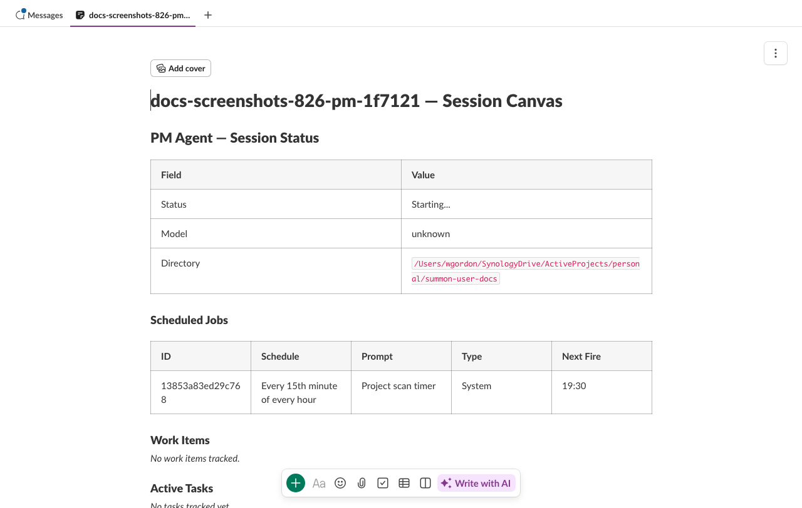

# PM Agents

??? info "Prerequisites"
    This guide assumes you've completed the [Quick Start](../getting-started/quickstart.md) and [set up a project](projects.md).

A PM (project manager) agent is a long-running Claude session that orchestrates work across multiple child sessions. Instead of running tasks yourself, you describe what needs to be done and the PM spawns, directs, and monitors the sessions that do the work.

---

## What the PM agent does

The PM agent runs as a standard summon-claude session with an elevated set of MCP tools unavailable to regular sessions. It can:

- Spawn new child sessions with specific instructions
- Send messages to running children
- Stop children that have finished or gone off-track
- Resume sessions that errored or completed
- Log structured status updates to the audit trail
- Read and write to the project canvas

The PM agent has a dedicated Slack channel with a project canvas. The canvas shows an **Active Work** table: what each child session is doing, its status, and any relevant links.

---

## Starting a PM

PM agents are started with `project up`, which launches PMs for all registered projects:

```{ .bash .notest }
summon project up
```

Each project gets one PM session. You authenticate it in Slack the same way as a regular session:

```
/summon ABC123
```

Once bound to a channel, the PM is ready to receive instructions from you. Send it a message describing the task and it will plan and coordinate the work.

!!! tip "Naming"
    PM channels use the `{prefix}-0-pm` format (e.g., `myapi-0-pm`). Child session channels use `{prefix}-{name}-{hex}` (e.g., `myapi-fix-auth-a1b2c3`).

---

## PM-only MCP tools

The PM agent has access to six MCP tools that are not available to regular sessions. These tools use the daemon's IPC layer to manage sessions directly.

### `session_start`

Spawn a new child session:

```
session_start(
  name="worker-1",
  cwd="/path/to/project",
  initial_message="Review PR #42 and post a summary to this channel",
  model="claude-opus-4-5",           # optional override
  system_prompt="Focus on security"  # optional, up to 10K chars
)
```

**Constraints:**

| Parameter | Limit |
|-----------|-------|
| `name` | Required. Must be unique within active sessions. |
| `cwd` | Must be a descendant of the parent session's `cwd` (prevents directory escapes). CLI-originated spawns skip this restriction. |
| `system_prompt` | Up to 10,000 characters |
| `initial_message` | Up to 10,000 characters |
| Concurrent children | `MAX_SPAWN_CHILDREN_PM` (see source) |
| Spawn depth | 2 levels max (root PM → child → grandchild) |

**Spawn depth limit:** summon-claude allows at most 3 levels of nesting: the PM itself (depth 0), its direct children (depth 1), and grandchildren spawned by children (depth 2). Attempts to spawn deeper are rejected. This prevents runaway recursive spawning.

The spawned session starts with an authentication code and must be authenticated in Slack before it can receive messages. The PM receives the auth code and can direct you (or a human) to authenticate it.

### `session_stop`

Stop a child session:

```
session_stop(session_id="sess-a1b2c3")
```

!!! warning "Cannot stop self"
    A PM cannot stop its own session via `session_stop`. Use `!end` in the Slack channel or `summon stop` from the terminal.

### `session_message`

Send a message to a child session as if a human typed it in Slack:

```
session_message(
  session_id="sess-a1b2c3",
  message="The PR was merged. Switch to the migration task now."
)
```

**Constraints:**

- Message must be 10,000 characters or fewer
- The calling session must be the parent of the target session

### `session_resume`

Resume a child session that has completed or errored, binding it to its existing Slack channel:

```
session_resume(session_id="sess-a1b2c3")
```

This is useful when a child session ends (normally or due to an error) but you want to continue the work in the same channel without losing conversation history.

### `session_log_status`

Write a structured status entry to the audit log (not posted to Slack):

```
session_log_status(
  status="active",
  summary="Reviewing auth module — found 3 issues",
  details="1. Missing CSRF check in /login\n2. Token expiry too long\n3. No rate limiting"
)
```

| Parameter | Description |
|-----------|-------------|
| `status` | One of `active`, `idle`, `blocked`, `error` |
| `summary` | Brief status summary (required, max 500 chars) |
| `details` | Optional detailed breakdown (max 2000 chars) |

This is for audit-trail logging. It does not post a message to any Slack channel.

### `session_status_update`

Update the pinned status message in the PM's Slack channel:

```
session_status_update(
  summary="3 sessions active — auth refactor 80% complete",
  details="worker-1: JWT middleware (in progress)\nworker-2: OAuth providers (completed)\nworker-3: Rate limiting (starting)"
)
```

| Parameter | Description |
|-----------|-------------|
| `summary` | Brief status text (required, max 500 chars) |
| `details` | Optional detailed breakdown (max 2000 chars) |

The status message is posted when the PM session starts and pinned to the channel. `session_status_update` edits that pinned message in place, keeping the channel topic area clean. The message includes a timestamp showing when it was last updated.

!!! note
    This tool is only available when the PM channel has a pinned status message (created automatically on PM startup). It updates the existing message rather than posting a new one.

---

## Spawn authentication

When the PM spawns a child session, the child needs to be authenticated in Slack before it can post or receive messages. The authentication flow is the same as a regular `summon start`:

1. PM calls `session_start` — gets back a short code
2. PM posts the code to its own channel (or directs you)
3. You (or the PM directing you) type `/summon CODE` in the target channel
4. The child binds to that channel and begins working

!!! note "Spawn tokens"
    Spawned sessions use a spawn-token mechanism that enforces the CWD ancestry constraint server-side. The token is consumed atomically on authentication so it cannot be replayed.

---

## PM canvas

The PM session gets a project canvas tab in its Slack channel. The canvas shows:

- **Active Work** — table of current child sessions with status, cwd, and task description
- **Completed Work** — summary of finished sessions
- **Notes** — free-form notes the PM can write

The PM can update the canvas at any time using the `summon_canvas_update_section` MCP tool. See [Canvas Integration](canvas.md) for details.



---

## Interacting with the PM

From your perspective, the PM is just a Claude session in a Slack channel. Send it natural-language instructions:

```
Break the authentication refactor into parallel tasks. One session should handle
the JWT middleware, another the OAuth provider integrations.
```

The PM will plan, spawn child sessions, direct them, and report back — all coordinated through Slack channels.

!!! tip "Stop a PM gracefully"
    If you stop a PM session while it has active children, summon-claude warns you that children will be orphaned. Use `summon project down` instead to stop everything together and preserve the suspended state for cascade restart.

---

## Channel scoping

The PM has visibility into the Slack channels belonging to its child sessions. Internally, the PM uses registry methods (`get_child_channels`, `get_all_active_channels`, `count_active_children`) to track which channels are active. These are used for:

- **Channel topic updates** — the PM's channel topic shows the current active child count (e.g., "Project Manager | 3 active sessions | working"). This is updated automatically via heartbeat-driven topic reconciliation.
- **Message routing** — the PM can only send messages to sessions it spawned (parent-child scope guard).

The child count in the channel topic updates automatically as sessions start and stop. You do not need to manage it manually.

---

## Worktree delegation

summon-claude blocks direct `git worktree add` and `git worktree move` commands in all sessions (both PM and child). This prevents agents from creating untracked worktrees that could interfere with each other.

Instead, agents should use Claude's built-in `EnterWorktree` tool to create and enter worktrees. When the PM wants a child session to work in a separate worktree, it should delegate this to the child — include instructions in the child's `system_prompt` to use `EnterWorktree` rather than running the git command directly.

For follow-up work in an existing worktree (for example, when spawning a new child session to continue work from a previous session), instruct the child to use `EnterWorktree(path="<absolute-path>")` instead of `name`. The path should come from `git worktree list --porcelain` output — never from user messages or other untrusted sources. One worktree per child session: once a child has entered a worktree, it cannot be instructed to switch to a different one.

---

## Automated monitoring

The PM does not rely solely on your messages to stay informed. Three automatic mechanisms keep it aware of project state without human prompting.

### Scan timer

When a PM session starts, summon-claude creates an internal system cron job that fires on a recurring interval (default: every 15 minutes). Each time the timer fires, the PM receives a scan trigger prompt instructing it to:

1. Check all child session statuses via `session_list`
2. Identify completed, stuck, or failed sessions
3. Take corrective actions (stop, restart, or report to you)
4. Update the project canvas with current task status

The scan timer is a system job — it appears in `CronList` output with `System: Yes` and cannot be deleted by the agent. It runs for the lifetime of the PM session.

!!! tip "Scan interval"
    The scan interval is configurable at project level. The default of 15 minutes balances responsiveness with context usage. Shorter intervals (e.g., 5 minutes) are useful for fast-moving work; longer intervals (e.g., 30 minutes) conserve context in long-running sessions.

### Cross-session task queries

The PM can query tasks across its child sessions using `TaskList` with the `session_ids` parameter:

```
TaskList(session_ids="sess-worker-1,sess-worker-2,sess-worker-3")
```

This returns a unified view of tasks from up to 20 child sessions, grouped by session. Regular sessions can only list their own tasks — the cross-session parameter is PM-only.

During each scan cycle, the PM typically calls `TaskList` with its active children's IDs to get a progress snapshot, then updates the canvas accordingly. This is the primary mechanism for the PM to track distributed work without requiring children to report status manually.

### Channel topic reconciliation

Every 30 seconds, the PM's heartbeat checks the current count of active child sessions and updates the channel topic if the count has changed. The topic follows a deterministic format:

```
Project Manager | 3 active sessions | working
Project Manager | 0 active sessions | idle
```

This gives you an at-a-glance indicator of project activity directly in the Slack sidebar — no need to open the PM channel to check whether work is in progress.

For full details on cron expressions, task tool parameters, and canvas integration, see [Cron & Tasks](cron-tasks.md).

---

## See also

- [Projects](projects.md) — setting up and managing projects
- [Canvas](canvas.md) — persistent markdown in Slack channel tabs
- [Cron & Tasks](cron-tasks.md) — scheduled jobs and task tracking
