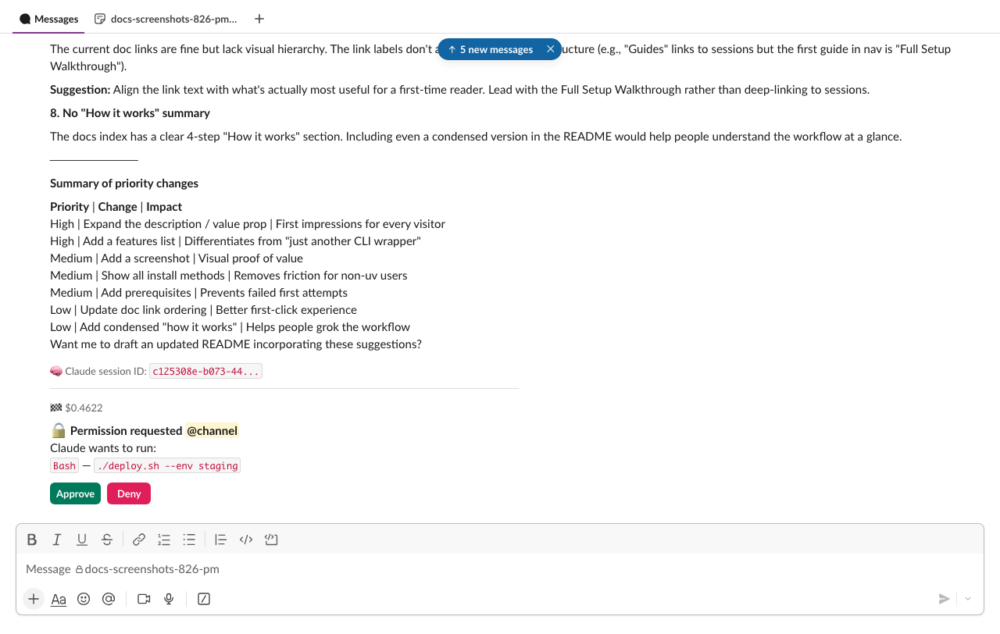
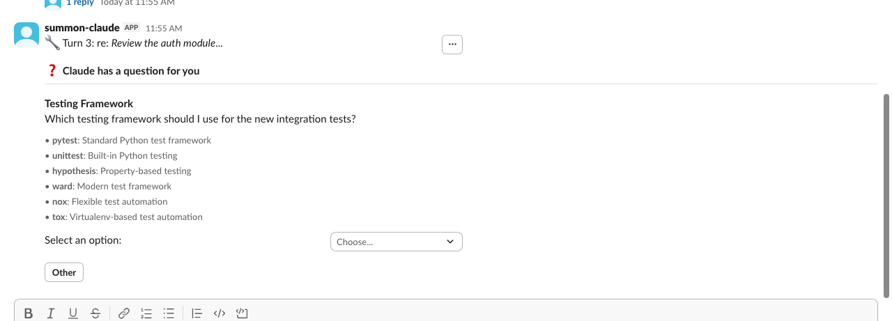

# Agent Permissions

When Claude wants to run a tool that could modify files, execute commands, or take other consequential actions, summon pauses and asks for your approval in Slack. This keeps you in control without interrupting every read operation.



---

## Read-only by default

Summon sessions start in **read-only mode**. Claude can freely use research tools (Read, Grep, Glob, WebSearch, etc.) but write-capable tools are blocked until containment is active.

<!-- permissions:write-gated -->
**Write-gated tools:** `Bash`, `Edit`, `MultiEdit`, `NotebookEdit`, `Write` (and the SDK alias `str_replace_editor`)
<!-- /permissions:write-gated -->

Containment is activated in two ways depending on whether the session directory is a git repository:

- **Git repository:** Claude must call `EnterWorktree` to create an isolated working copy. The containment root is the worktree directory.
- **Non-git directory:** Containment is activated automatically when the session starts, using the session's working directory as the containment root. No `EnterWorktree` call is needed (or available).

When Claude tries to use a write-gated tool before containment is active, summon automatically denies the request. Once containment is active:

1. The first write-gated tool triggers a **one-time Slack approval** prompt. For non-git sessions, the approval message includes a warning that changes cannot be automatically rolled back.
2. After approval, writes **within the containment root** are auto-approved — CWD containment ensures file-targeting tools (Edit, Write, etc.) can only modify files inside the containment root without additional prompts.
3. Writes **outside the containment root** still require Slack approval, with per-path session caching available.
4. `Bash` always requires HITL on first use, with per-command session caching (exact match).

### Safe-dir exception

You can configure directories where writes are allowed **without entering containment**:

```bash
summon config set SUMMON_SAFE_WRITE_DIRS "hack/,.dev/"
```

Paths are **comma-separated**. Relative paths (e.g. `hack/`) are resolved relative to the project root (the `cwd` passed to the session). Absolute paths (e.g. `/opt/shared/config/`) are also supported. Tilde (`~`) is expanded to the home directory. Trailing slashes are optional — `hack` and `hack/` are equivalent.

Files written to these directories bypass the containment requirement entirely. Paths are resolved with symlink protection (`Path.resolve()` on both sides) to prevent escapes. Setting `safe_write_dirs=.` exempts the entire project directory for file-targeting tools (Bash remains gated regardless).

---

## Auto-approved tools

The following tools are always approved without prompting. They are read-only and cannot modify your system:

<!-- permissions:auto-approve -->
| Tool | Description |
|------|-------------|
| `Read` / `Cat` | Read file contents |
| `Grep` | Search file contents |
| `Glob` | List files by pattern |
| `WebSearch` | Search the web |
| `WebFetch` | Fetch a URL |
| `LSP` | Language server protocol queries |
| `ListFiles` | List directory contents |
| `GetSymbolsOverview` | Read code symbols overview |
| `FindSymbol` | Find a symbol definition |
| `FindReferencingSymbols` | Find symbol references |
<!-- /permissions:auto-approve -->

Summon's own MCP tools (`summon-cli`, `summon-slack`, `summon-canvas`) are also auto-approved — they are internal tools already scoped to the session's permissions.

---

## Approval flow

When Claude requests a tool that needs approval:

1. **Interactive message** — summon posts a message in the session channel with the tool details and action buttons.
2. **You click Approve, Approve for session, or Deny** — the interactive message is deleted and a persistent confirmation is posted in the turn thread.
3. **Claude continues** — if approved, Claude runs the tool; if denied, Claude is told the action was denied and adapts.

```
Claude wants to run:
`Bash`: `npm run build`

[Approve]  [Approve for session]  [Deny]
```

### Approve for session

Clicking **Approve for session** caches the tool for the remainder of the session:

- **Write-gated tools** (Edit, Write, Bash, etc.) — the specific **argument** is cached: the file path for file tools, the command string for Bash. This prevents blanket `Edit(*)` or `Bash(*)` approval. Writes within the containment root are already auto-approved by CWD containment, so this mainly applies to writes outside the containment root and all Bash commands.
- **Other tools** — the tool name is cached; all subsequent uses are auto-approved.

The confirmation message shows what was cached:

```
✅ Approved for session: `Bash`: `git status`
✅ Approved for session: `Edit`: `/etc/config.ini`
```

!!! warning "GitHub write tools are never session-cached"
    Tools in the GitHub MCP require-approval list (merge, delete branch, create PR, etc.) always require explicit Slack approval — even if you click "Approve for session." This is a defense-in-depth measure.

!!! info "CWD containment and `allowedTools`"
    Write-gated tools that target paths outside the containment root always require Slack approval, even if your `~/.claude/settings.json` includes them in `allowedTools`. This is the same defense-in-depth principle used for GitHub tools — `allowedTools` cannot override CWD containment.

### Batched requests

If Claude requests multiple tools within a 2-second window (configurable via `SUMMON_PERMISSION_DEBOUNCE_MS`), they are batched into a single approval message:

```
Claude wants to perform 3 actions:
1. `Edit`: `src/auth/login.py`
2. `Write`: `src/auth/token.py`
3. `Bash`: `python -m pytest tests/test_auth.py`

[Approve]  [Approve for session]  [Deny]
```

Approve or Deny applies to all tools in the batch. "Approve for session" caches each tool's primary argument (file path or command).

!!! tip "Debounce tuning"
    The default 2000ms window catches most batches naturally. Lower it (e.g. `SUMMON_PERMISSION_DEBOUNCE_MS=500`) to reduce latency, or set it to `0` to get a separate message per tool.

---

## Timeout

Permission requests expire after **15 minutes** (configurable via `SUMMON_PERMISSION_TIMEOUT_S`). If you do not respond:

- The request is automatically denied.
- The interactive message is deleted.
- A timeout message is posted in the turn thread.
- Claude is told the permission timed out and adapts (typically by reporting it could not complete the action).

Set `SUMMON_PERMISSION_TIMEOUT_S=0` to disable the timeout entirely — permission requests will wait indefinitely until you respond.

---

## GitHub MCP permissions

When GitHub is authenticated (via `summon auth github login`), Claude has access to GitHub tools via the remote MCP server. These follow separate permission tiers:

<!-- permissions:github-allow -->
**Auto-approved (read-only):** Any tool with a `get_`, `list_`, `search_` prefix, plus `get_file_contents` and `pull_request_read`.
<!-- /permissions:github-allow -->

**Always require Slack approval** — checked before prefix rules, so no `allowedTools` pattern can bypass them:

<!-- permissions:github-deny -->
| Tool | Reason |
|------|--------|
| `add_issue_comment` | Visible to others |
| `close_issue` | Visible to others |
| `close_pull_request` | Visible to others |
| `create_issue` | Visible to others |
| `create_or_update_file` | Writes to remote |
| `create_pull_request` | Visible to others |
| `delete_branch` | Irreversible |
| `merge_pull_request` | Irreversible |
| `pull_request_review_write` | Visible to others |
| `push_files` | Writes to remote |
| `update_pull_request_branch` | Modifies shared branch |
<!-- /permissions:github-deny -->

Any GitHub MCP tool not on either list also requires Slack approval (fail-closed).

!!! warning "Defense in depth"
    The require-approval list is checked before prefix-based auto-approve. Even if your `~/.claude/settings.json` has a broad `allowedTools` pattern that would normally permit these tools, summon still routes them to Slack for approval.

---

## Jira MCP permissions

When Jira is authenticated (via `summon auth jira login`), Claude has access to Jira tools via the Atlassian Rovo MCP server. Jira uses a **strictly read-only** permission model — all write operations are hard-denied, not routed to Slack for approval.

<!-- permissions:jira-allow -->
**Auto-approved (read-only):** Tools matching `get*`, `lookup*`, `search*` prefixes, plus the exact match `atlassianUserInfo`.
<!-- /permissions:jira-allow -->

**Hard-denied (always blocked)** — checked before auto-approve prefixes:

<!-- permissions:jira-deny -->
| Tool | Reason |
|------|--------|
| `addCommentToJiraIssue` | Write operation |
| `addWorklogToJiraIssue` | Write operation |
| `createConfluenceFooterComment` | Write operation |
| `createConfluenceInlineComment` | Write operation |
| `createConfluencePage` | Write operation |
| `createIssueLink` | Write operation |
| `createJiraIssue` | Write operation |
| `editJiraIssue` | Write operation |
| `fetchAtlassian` | Generic ARI accessor — bypasses per-tool gating |
| `transitionJiraIssue` | Write operation |
| `updateConfluencePage` | Write operation |
<!-- /permissions:jira-deny -->

!!! warning "`fetchAtlassian` is not a read-only tool"
    Despite its name, `fetchAtlassian` is a generic Atlassian Resource Identifier (ARI) accessor that can fetch arbitrary resources across projects and products. It bypasses the per-tool permission model and is always blocked.

Any Jira MCP tool not in either list is denied by default (fail-closed). New tools from future Rovo MCP updates require explicit classification before they can be used.

!!! note "No HITL tier for Jira"
    Unlike GitHub, Jira has no "requires Slack approval" tier. The OAuth scope is `read:jira-work` — write operations would fail at the API level even if summon allowed them. The hard-deny list provides defense-in-depth.

For the full integration guide, see [Jira Integration](../guide/jira-integration.md).

---

## AskUserQuestion

Claude can ask you structured questions mid-task using the `AskUserQuestion` tool. This appears as an interactive message in the session channel:

```
Claude has a question for you

Which database should I use for the session store?
  [SQLite]  [PostgreSQL]  [Redis]  [Other]
```

- **Single-select:** click a button to answer and continue.
- **Multi-select:** toggle options, then click **Done**.
- **Other:** click **Other** to open a modal dialog for free-text input.

Your answers are returned to Claude as structured data. The question times out after 5 minutes if unanswered. The interactive message is deleted after all questions are answered.

### Adaptive UI

The question UI adapts based on the number of options:

- **2-4 options:** rendered as individual buttons in the message
- **5+ options (single-select):** rendered as a dropdown (`static_select`) with an "Other" button below
- **5+ options (multi-select):** rendered as a multi-select dropdown (`multi_static_select`) with "Done" and "Other" buttons below



### "Other" modal

Clicking **Other** opens a Slack modal dialog with a multiline text input. The modal is self-contained — typing in the channel is never intercepted. The submission routes through `dispatch_view_submission` with the channel and question metadata encoded in the modal's `private_metadata`.

---

## Auto-mode classifier

After the agent enters a worktree, summon can automatically approve or block tool calls using a secondary Sonnet classifier — without waiting for Slack approval on every action.

The classifier evaluates each pending tool call against configurable prose rules:

- **Allow rules** — actions that are safe to auto-approve (e.g. local file operations, running tests, git status)
- **Deny rules** — actions that should be blocked (e.g. force pushing, production deploys, sending credentials externally)
- **Uncertain** — when the classifier can't confidently decide, the tool falls through to Slack HITL

The classifier only runs **after worktree entry**. Read-only sessions (before `EnterWorktree`) never use it — all tool decisions go through the standard permission flow.

**Path-based worktree entries (CLI 2.1.105+):** When an agent uses `EnterWorktree(path="...")` to re-enter an existing worktree, the containment root is set to the resolved worktree path validated against `git worktree list --porcelain`. The path must be registered in git and must be within the project root — unregistered paths or paths outside the project boundary are rejected (fail-closed: containment flags are set but the root stays `None`, so all writes still require HITL approval). The classifier activates on path-based entry the same as name-based entry.

### Activation

1. Session starts in read-only mode — classifier is dormant
2. Agent enters worktree via `EnterWorktree` (name-based creation or path-based re-entry)
3. If `SUMMON_AUTO_CLASSIFIER_ENABLED=true` (default), the classifier activates
4. Tool calls now go through: write gate → static lists → caches → **classifier** → SDK allow → Slack HITL

Use `!auto on/off` to toggle the classifier mid-session. `!auto on` only works after worktree entry.

### Fallback safety

If the classifier blocks too many consecutive tool calls (3) or too many total (20), it automatically pauses and falls back to manual Slack approval. A notification is posted to the channel. Use `!auto on` to re-enable.

The classifier's block reason is never shown to the outer Claude agent — only a generic "Blocked by auto-mode policy" message is returned. This prevents the agent from learning to craft bypass attempts.

### Configuration

See [Auto Mode](environment-variables.md#auto-mode) for the environment variables that control the classifier.

---

## Permission flow (internal)

The full permission evaluation order in `handle()`:

| Step | Check | Result |
|------|-------|--------|
| 1 | AskUserQuestion intercept | Route to interactive UI |
| 2 | Write gate (`_WRITE_GATED_TOOLS`) | SDK deny → Deny; safe-dir → Allow; no containment → Deny; first write → HITL; within containment root → Allow; outside containment root → fall through |
| 3 | SDK deny suggestions | Deny |
| 4 | Static auto-approve (`_AUTO_APPROVE_TOOLS`) | Allow |
| 5 | GitHub deny-list (`_GITHUB_MCP_REQUIRE_APPROVAL`) | Always HITL |
| 6 | GitHub auto-approve (prefix matching) | Allow |
| 6a | Google MCP (`_GOOGLE_READ_TOOL_PREFIXES`: read-only prefix → Allow; all others → HITL) | Allow or HITL |
| 6b | Jira hard-deny (`_JIRA_MCP_HARD_DENY`) | Always Deny |
| 6c | Jira auto-approve (prefix + exact matching) | Allow |
| 7 | Summon MCP auto-approve (prefix matching) | Allow |
| 8 | Session-lifetime cached approvals | Allow (GitHub deny-list excluded) |
| 9 | Per-argument cache (exact match on primary arg) | Allow if arg matches (GitHub deny-list excluded) |
| 10 | Auto-classifier (Sonnet, only active after worktree entry) | Allow, Block, or fall through on uncertain |
| 11 | SDK allow suggestions | Allow (write-gated tools excluded — CWD containment cannot be overridden) |
| 12 | Slack HITL (interactive message, deleted after) | User decides |

<!-- permissions:google-read -->
**Google read-only prefixes (step 6a):** `check_`, `debug_`, `get_`, `inspect_`, `list_`, `query_`, `read_`, `search_`
<!-- /permissions:google-read -->

---

## Authorization scope

Only the authenticated user for a session can approve or deny permission requests. The authenticated user is the person who claimed the session with `/summon CODE` in Slack.

If a different user clicks the approval buttons, the action is ignored with a warning logged. This prevents other workspace members from approving actions on your behalf.
